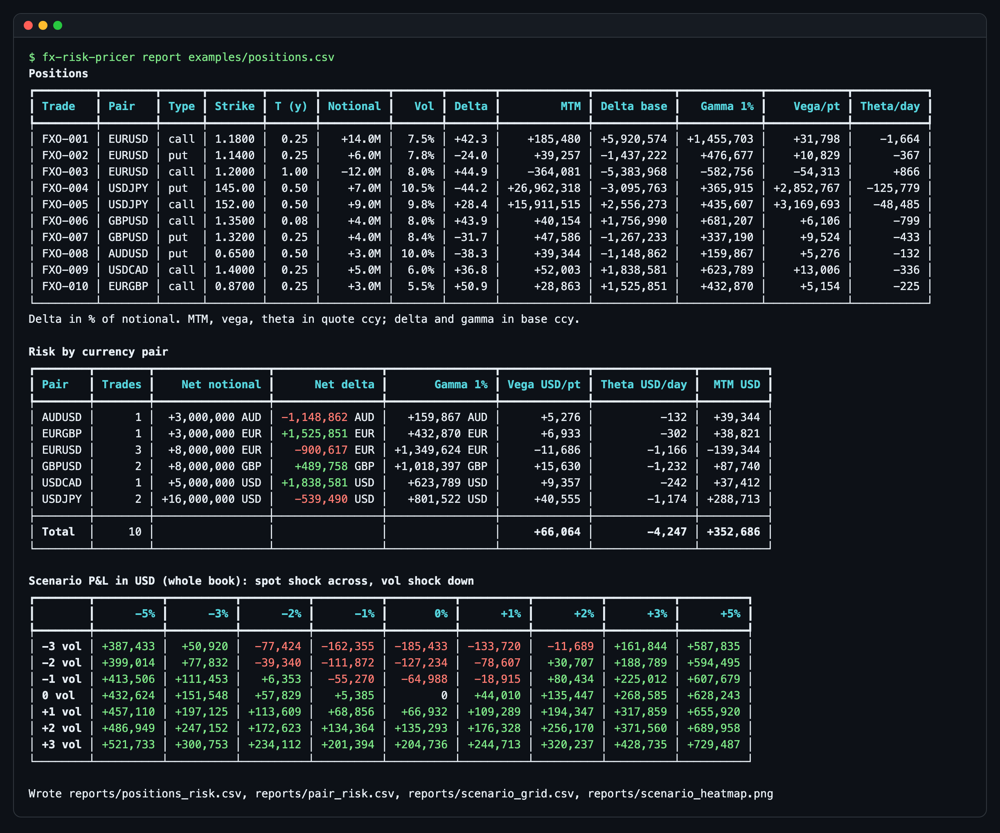
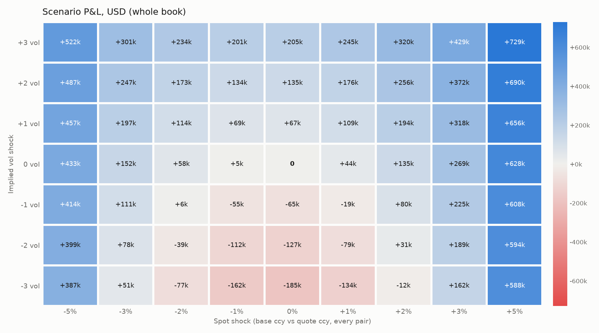

# fx-option-risk-pricer

A small command line risk engine for a book of European FX options. It prices each trade with
Garman-Kohlhagen, scales the Greeks to position level, nets risk by currency pair, and revalues
the whole book under a grid of spot and implied-vol shocks, which it prints as a table and saves
as a heatmap. The interesting part is getting the FX conventions right (which rate is domestic,
which currency the delta is in, how vega and theta are scaled) and proving it in the tests with
put-call parity and finite-difference checks on every Greek.





The sample book is long gamma and long vega: it makes money on large moves in either direction
and loses when spot sits still and implied vol falls, which is the red trough in the middle of
the grid.

## Features

- Garman-Kohlhagen price, spot delta, gamma, vega and theta for calls and puts, with analytic
  formulas checked against finite differences.
- Position risk from signed notional (negative = short): MTM, delta, 1% gamma, vega, theta.
- Risk by currency pair: net delta and gamma in the base currency, vega, theta and MTM in USD.
  Crosses such as EURGBP convert through the USD pairs in the book.
- Spot x vol scenario grid by full revaluation, for the whole book or one pair, printed with
  rich and saved as CSV and a PNG heatmap.
- Implied volatility solver (Newton on vega with a bisection fallback).
- CSV input with row-level validation errors, CSV output for every table.

## Quick start

```bash
python3 -m venv .venv
source .venv/bin/activate
pip install -e ".[dev]"

fx-risk-pricer report examples/positions.csv
```

That prints the three tables above and writes `reports/positions_risk.csv`, `pair_risk.csv`,
`scenario_grid.csv` and `scenario_heatmap.png`.

More examples:

```bash
# Scenario grid for one pair with custom shocks (spot in %, vol in vol points)
fx-risk-pricer report examples/positions.csv --pair USDJPY --spot-shocks=-4,-2,0,2,4 --vol-shocks=-2,0,2 --output-dir reports/usdjpy

# Back out the implied vol of a quoted premium (quote ccy per 1 unit of base)
fx-risk-pricer implied-vol --price 0.0291 --spot 1.56 --strike 1.60 --maturity 0.5 --r-dom 0.06 --r-for 0.08 --type call
# implied vol: 12.0002%
```

A Dockerfile is included that runs the sample report:

```bash
docker build -t fx-option-risk-pricer .
docker run --rm fx-option-risk-pricer
```

### Input format

```csv
trade_id,pair,type,strike,maturity,notional,spot,r_dom,r_for,vol
FXO-001,EURUSD,call,1.1800,0.25,14000000,1.1650,0.0400,0.0200,0.075
FXO-004,USDJPY,put,145.00,0.50,7000000,148.50,0.0050,0.0400,0.105
```

| Column | Meaning |
| --- | --- |
| `pair` | Six letters, `BASEQUOTE`. EURUSD is USD per 1 EUR. |
| `notional` | Base-currency amount. Negative for a short position. |
| `maturity` | Years to expiry, ACT/365. |
| `r_dom`, `r_for` | Continuously compounded rates of the quote and base currency. |
| `vol` | Implied volatility as a decimal (0.075 = 7.5%). |
| `trade_id` | Optional. |

## How it works

**Garman-Kohlhagen.** An FX option is Black-Scholes where the underlying pays a continuous
dividend equal to the foreign interest rate. For a pair quoted BASEQUOTE the quote currency is
domestic and the base currency is foreign:

```
d1 = [ln(S/K) + (r_dom - r_for + vol^2/2) T] / (vol sqrt(T)),   d2 = d1 - vol sqrt(T)
call = S e^(-r_for T) N(d1) - K e^(-r_dom T) N(d2)
put  = K e^(-r_dom T) N(-d2) - S e^(-r_for T) N(-d1)
```

For USDJPY that means `r_dom` is the JPY rate and `r_for` is the USD rate.

**Greek conventions.** Per one unit of base notional, values in quote currency:

| Greek | Convention |
| --- | --- |
| Delta | Spot delta, `dV/dS = ±e^(-r_for T) N(±d1)`. Times notional it is the base-currency amount to trade to hedge. Premium-included and forward deltas are not used. |
| Gamma | `d(delta)/dS`. Reported at position level as the change in base-currency delta for a 1% spot move. |
| Vega | Per 1 vol point (0.01 absolute), not per 1.00. |
| Theta | Value change for one calendar day passing (`dV/dt / 365`), so a long option has negative theta. |

**Aggregation.** Delta and gamma are only additive within a pair, so they stay in each pair's
base currency. Vega, theta and MTM are in the quote currency and convert to USD using spot from
the book (`XXXUSD` multiplies, `USDXXX` divides); a cross like EURGBP converts through GBPUSD.

**Scenarios.** Each cell reprices every option from scratch at shocked spot and vol. The spot
shock is relative and applied to every pair at once (the base currency moves by that % against
the quote), the vol shock is absolute and parallel, and time and rates are held fixed. P&L is
converted to USD at today's spots. Use `--pair` to see one pair in isolation, since a uniform
shock across EURUSD and USDJPY moves the dollar in opposite directions.

**Implied vol.** Newton's method on vega from 20%, keeping a bracket around the root and falling
back to bisection when a Newton step would leave it (deep out of the money, where vega is tiny).
Prices outside the no-arbitrage bounds are rejected up front.

## Testing

```bash
pytest -q
```

The suite checks a published reference value (Haug's GK example, 0.0291), put-call parity
(`C - P = S e^(-r_for T) - K e^(-r_dom T)`) across ATM, ITM, long-dated, negative-rate and
high-vol cases, every analytic Greek against a central finite difference, the implied vol round
trip, signed-notional scaling, USD conversion of crosses, that the scenario grid agrees with
delta and vega for small shocks, CSV validation errors, and the CLI end to end. CI runs it on
Python 3.12 for every push and pull request.

## Project layout

```text
fx_option_risk_pricer/
  pricing.py     GK price, Greeks, implied vol, position scaling
  portfolio.py   Pair aggregation, USD conversion, scenario grid
  report.py      rich tables and the matplotlib heatmap
  io.py          CSV loading/validation and CSV writing
  models.py      Dataclasses for positions, Greeks, position risk
  cli.py         fx-risk-pricer report / implied-vol
examples/
  positions.csv  Ten-trade sample book across six pairs
tests/           pytest suite
docs/images/     Screenshots generated from the sample book
```
